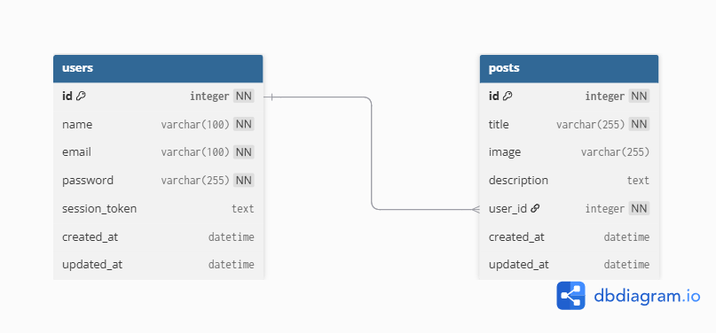
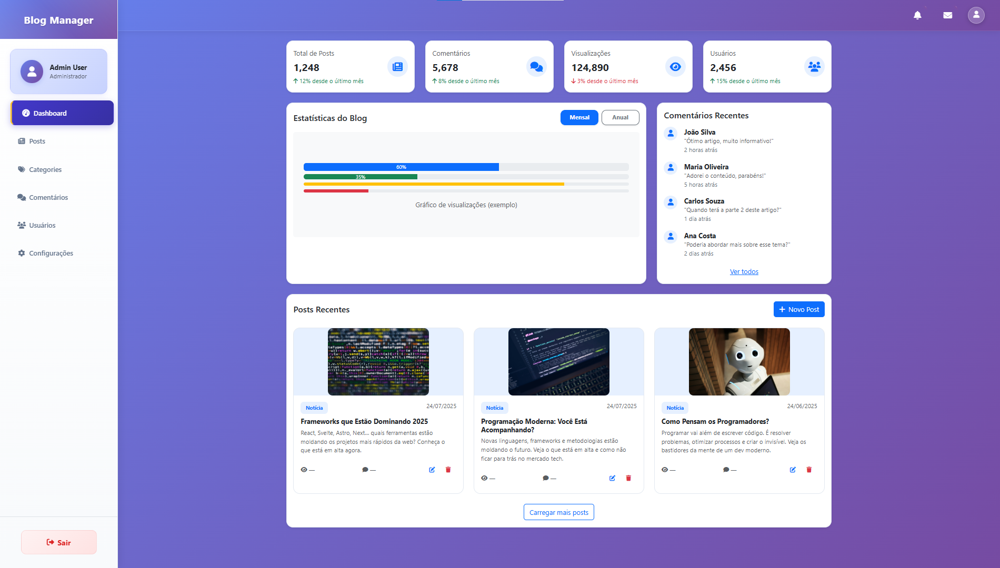
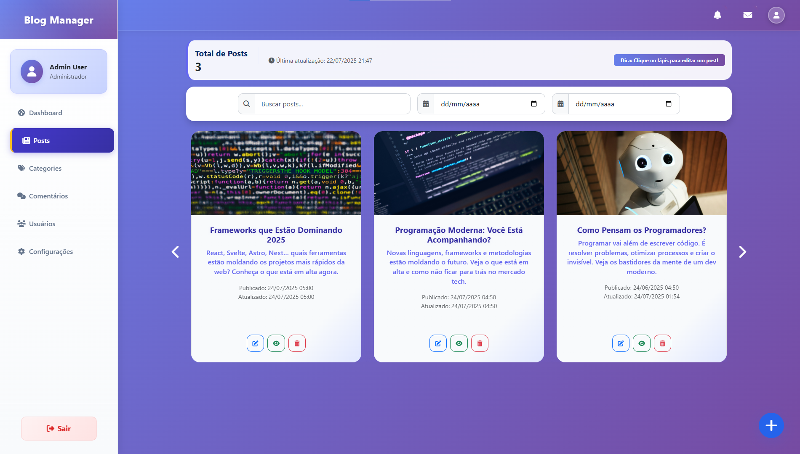
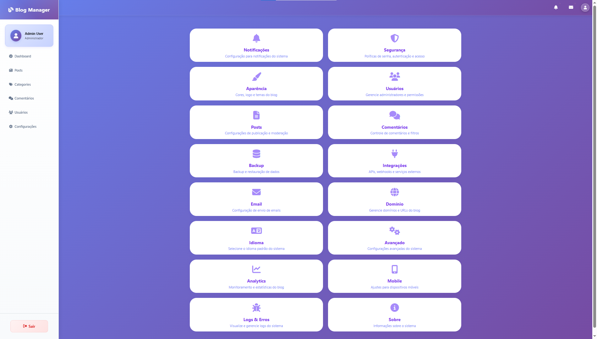
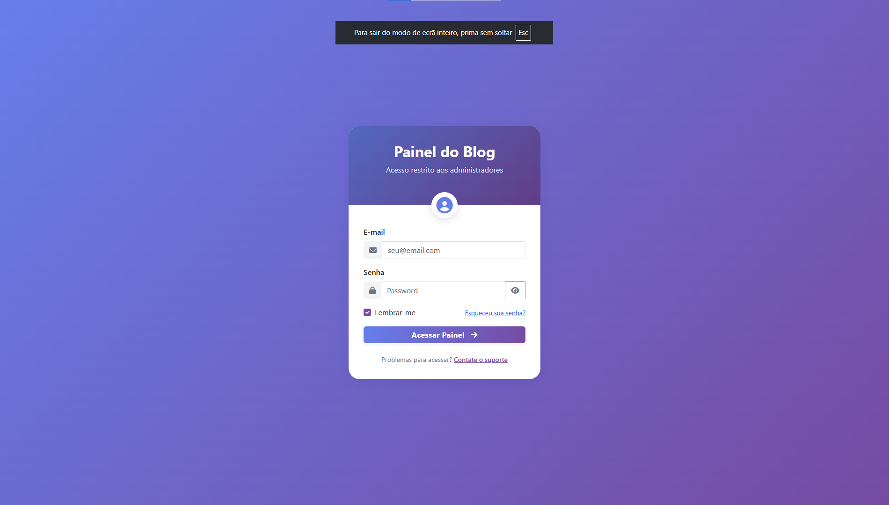
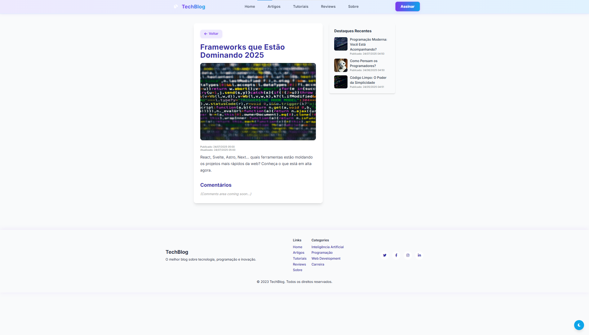

# 🚀 TechBlog - Modern Blog Management System

**A complete, professional blog management system built with CodeIgniter 4 and modern web technologies.**

<p align="center">
  
  
  
  
  
  
</p>

---

## 📑 Table of Contents
- [About the Project](#about-the-project)
- [Technologies Used](#technologies-used)
- [Features](#features)
- [🚀 Quick Start Guide](#-quick-start-guide)
- [📋 Detailed Installation](#-detailed-installation)
- [🔧 Troubleshooting](#-troubleshooting)
- [Project Structure](#project-structure)
- [Assessment Tasks](#assessment-tasks)
- [Challenges and Solutions](#challenges-and-solutions)
- [How to Contribute](#how-to-contribute)
- [Preview](#preview)

---

## 📝 About the Project

**TechBlog** is a modern, production-ready blog management system that evolved from a technical assessment into a professional-grade application. Built with CodeIgniter 4 and Eloquent ORM, it features a complete admin panel, modern public interface, and follows senior-level development practices.

### 🎯 **Key Features:**
- **Complete CRUD Operations** for blog posts with image upload
- **Modern Admin Panel** with responsive design and real-time interactions
- **Public Blog Interface** with search, filtering, and dark mode
- **User Authentication System** for both admin and regular users
- **Professional Code Structure** with proper namespacing and organization
- **Production-Ready** with security measures and error handling

---

## 🛠️ Technologies Used

### **Backend:**
- **PHP 8.1+** - Modern PHP with type hints and features
- **CodeIgniter 4.x** - Latest stable version with enhanced features
- **Eloquent ORM** - Laravel's Eloquent for CodeIgniter 4
- **MySQL/MariaDB** - Reliable database system

### **Frontend:**
- **Bootstrap 5.3** - Modern CSS framework with responsive design
- **jQuery 3.6** - DOM manipulation and AJAX requests
- **Font Awesome 6.4** - Professional icon library
- **Owl Carousel 2.3.4** - Smooth carousel functionality

### **Development Tools:**
- **Composer** - PHP dependency management
- **Git** - Version control
- **PSR-4** - Autoloading standard

---

## 🚀 Features

### 👨‍💻 **Admin Panel**
- **Secure Authentication** - Admin login with session management
- **Complete CRUD Operations** - Create, read, update, delete posts with image upload
- **Modern Interface** - Responsive dashboard with Bootstrap 5 and animations
- **Real-time Interactions** - AJAX-powered modals for seamless operations
- **Post Management** - Title, image, HTML description with preview
- **Security Features:**
  - Authentication and session validation on all admin routes
  - Protection against unauthorized access
  - Invalid session destruction
  - Secure redirection to login

### 🌐 **Public Blog**
- **Post Listing** - Responsive grid with search and filtering
- **Post Details** - Full article view with sidebar highlights
- **Dark Mode** - Toggle between light and dark themes
- **Modern Design** - Clean, professional interface
- **Mobile Responsive** - Optimized for all devices
- **Search & Filter** - Find posts by title, content, or date

### 🔐 **User Authentication**
- **Dual System** - Separate admin and user authentication
- **Registration** - User signup with validation
- **Login/Logout** - Secure session management
- **Remember Me** - Persistent login functionality

### 🎨 **UI/UX Features**
- **Responsive Design** - Works on desktop, tablet, and mobile
- **Dark/Light Mode** - User preference toggle
- **Smooth Animations** - CSS transitions and micro-interactions
- **Loading States** - Visual feedback for user actions
- **Error Handling** - User-friendly error messages

---

## 🚀 Quick Start Guide

### **Pré-requisitos (Verificar antes de começar):**
```bash
# Verificar PHP 8.1+
php --version

# Verificar Composer
composer --version

# Verificar MySQL/MariaDB
mysql --version
```

### **Passos Rápidos:**
```bash
# 1. Clonar o repositório
git clone [URL_DO_REPOSITORIO]
cd web-developer-junior

# 2. Instalar dependências
composer install

# 3. Configurar banco de dados
mysql -u root -p
CREATE DATABASE blog CHARACTER SET utf8mb4 COLLATE utf8mb4_unicode_ci;
EXIT;

# 4. Importar estrutura do banco
mysql -u root -p blog < docs/db/blog.sql

# 5. Configurar permissões
mkdir writable/cache
mkdir writable/logs
mkdir writable/session

# 6. Iniciar servidor
php spark serve
```

### **Acessar o Projeto:**
- **Blog Público**: http://localhost:8080/blog
- **Admin**: http://localhost:8080/admin

### **Credenciais Padrão:**
- **Admin**: admin@gmail.com / admin123
- **Usuário**: user@gmail.com / user123

---

## 📋 Detailed Installation

### **1. Verificação de Pré-requisitos**

#### **PHP 8.1+**
```bash
php --version
# Deve mostrar PHP 8.1 ou superior
```

#### **Composer**
```bash
composer --version
# Deve mostrar a versão do Composer
```

#### **MySQL/MariaDB**
```bash
mysql --version
# Deve mostrar a versão do MySQL/MariaDB
```

### **2. Clone e Configuração Inicial**

```bash
# Clonar o repositório
git clone [URL_DO_REPOSITORIO]
cd web-developer-junior

# Verificar se está no diretório correto
ls -la
# Deve mostrar: app/, public/, composer.json, spark, etc.

# Instalar dependências
composer install

# Regenerar autoloader
composer dump-autoload
```

### **3. Configuração do Banco de Dados**

#### **A. Criar Banco de Dados**
```bash
# Acessar MySQL
mysql -u root -p

# Criar banco de dados
CREATE DATABASE blog CHARACTER SET utf8mb4 COLLATE utf8mb4_unicode_ci;

# Verificar se foi criado
SHOW DATABASES;

# Sair do MySQL
EXIT;
```

#### **B. Importar Estrutura**
```bash
# Importar arquivo SQL
mysql -u root -p blog < docs/db/blog.sql

# Verificar se as tabelas foram criadas
mysql -u root -p
USE blog;
SHOW TABLES;
# Deve mostrar: posts, users
EXIT;
```

### **4. Configuração de Arquivos**

#### **A. Configurar Banco de Dados**
Editar `app/Config/Database.php`:
```php
public array $default = [
    'hostname' => 'localhost',
    'username' => 'root',
    'password' => 'sua_senha_aqui', // Se tiver senha
    'database' => 'blog',
    'DBDriver' => 'MySQLi',
    'charset'  => 'utf8mb4',
    'DBCollat' => 'utf8mb4_unicode_ci',
    // ... outras configurações
];
```

#### **B. Configurar Eloquent**
Editar `app/Config/Eloquent.php`:
```php
$capsule->addConnection([
    'driver'    => 'mysql',
    'host'      => 'localhost',
    'database'  => 'blog',
    'username'  => 'root',
    'password'  => 'sua_senha_aqui', // Se tiver senha
    'charset'   => 'utf8mb4',
    'collation' => 'utf8mb4_unicode_ci',
    // ... outras configurações
]);
```

### **5. Configuração de Permissões**

#### **A. Criar Diretórios Necessários**
```bash
# Criar diretórios
mkdir -p writable/cache
mkdir -p writable/logs
mkdir -p writable/session
mkdir -p writable/uploads
mkdir -p public/uploads/posts

# Verificar se foram criados
ls -la writable/
```

#### **B. Configurar Permissões (Linux/Mac)**
```bash
# Dar permissões de escrita
chmod -R 755 writable/
chmod -R 755 public/uploads/

# Verificar permissões
ls -la writable/
ls -la public/uploads/
```

#### **C. Configurar Permissões (Windows)**
```bash
# No Windows, garantir que as pastas são graváveis
# Clicar com botão direito → Propriedades → Segurança → Editar
# Adicionar permissões de escrita para o usuário do servidor web
```

### **6. Executar o Projeto**

```bash
# Verificar se está no diretório correto
pwd
# Deve mostrar: /caminho/para/web-developer-junior

# Verificar se o arquivo spark existe
ls -la spark

# Iniciar servidor
php spark serve

# Se funcionar, deve mostrar:
# CodeIgniter development server started at http://localhost:8080
```

### **7. Testar o Projeto**

#### **A. Testar Blog Público**
1. Abrir http://localhost:8080/blog
2. Deve mostrar a página inicial do blog
3. Testar navegação entre páginas

#### **B. Testar Admin**
1. Abrir http://localhost:8080/admin
2. Fazer login com: admin@gmail.com / admin123
3. Testar criação de posts

---

## 🔧 Troubleshooting

### **Erro: "Could not open input file: spark"**
```bash
# Solução: Verificar se está no diretório correto
pwd
# Deve mostrar: /caminho/para/web-developer-junior

# Se não estiver, navegar para o diretório
cd web-developer-junior

# Verificar se o arquivo spark existe
ls -la spark
```

### **Erro: "Class Config\Eloquent not found"**
```bash
# Solução: Regenerar autoloader
composer dump-autoload

# Verificar se o arquivo Eloquent.php existe
ls -la app/Config/Eloquent.php
```

### **Erro: "Cache unable to write"**
```bash
# Solução: Criar diretório cache
mkdir -p writable/cache

# Verificar permissões
ls -la writable/
```

### **Erro: "Database connection failed"**
```bash
# Solução: Verificar configurações do banco
# 1. Verificar se MySQL está rodando
# 2. Verificar credenciais em app/Config/Database.php
# 3. Verificar se o banco 'blog' existe
mysql -u root -p
SHOW DATABASES;
USE blog;
SHOW TABLES;
```

### **Erro: "404 Not Found"**
```bash
# Solução: Verificar configuração do .htaccess
# Verificar se o arquivo public/.htaccess existe
ls -la public/.htaccess

# Se não existir, copiar do arquivo original
```

### **Erro: "Permission denied"**
```bash
# Solução: Configurar permissões
chmod -R 755 writable/
chmod -R 755 public/uploads/

# No Windows, verificar permissões nas propriedades da pasta
```

### **Problema: Páginas carregam lentamente**
```bash
# Solução: Verificar configurações de cache
# O cache já está configurado como 'dummy' para desenvolvimento
# Verificar se não há problemas de rede ou banco de dados
```

### **Problema: URLs não funcionam (navegação)**
```bash
# Solução: Verificar configuração do .htaccess
# Verificar se o mod_rewrite está habilitado no Apache
# Verificar se as URLs no JavaScript estão corretas
```

---

## 🗂️ Project Structure

```
web-developer-junior/
├── 📁 app/
│   ├── 📁 Controllers/
│   │   ├── 📁 Admin/           # Admin controllers (Auth, Post)
│   │   └── 📁 Blog/            # Public blog controllers
│   ├── 📁 Models/              # Eloquent models (User, Post)
│   ├── 📁 Views/               # Blade-like templates
│   │   ├── 📁 admin/           # Admin panel views
│   │   ├── 📁 auth/            # Authentication views
│   │   ├── 📁 blog/            # Public blog views
│   │   └── 📁 errors/          # Error pages
│   └── 📁 Config/              # Application configuration
├── 📁 public/                  # Web root
│   ├── 📁 assets/
│   │   ├── 📁 css/             # Stylesheets
│   │   ├── 📁 js/              # JavaScript files
│   │   └── 📁 uploads/         # User uploaded files
├── 📁 docs/                    # Documentation & assets
│   └── 📁 db/                  # Database files
├── 📄 API.md                   # API documentation
├── 📄 composer.json            # PHP dependencies
└── 📄 README.md                # This file
```

### **Key Files:**
- **`API.md`** - Complete API documentation with routes and models
- **`docs/db/blog.sql`** - Database schema and sample data
- **`composer.json`** - Project metadata and dependencies

## 🗄️ Database & Diagrams

Database files and diagrams are organized in `/docs/db`:

- [`blog.sql`](docs/db/blog.sql): Complete SQL script to import the database into MySQL.
- [`diagrama_workbench.sql`](docs/db/diagrama_workbench.sql): Workbench diagram script.
- [`diagrama_png.png`](docs/db/diagrama_png.png): Database diagram image.

### Database Schema

#### **Users Table:**
- `id` - Primary key
- `name` - User full name
- `email` - Unique email address
- `password` - Hashed password
- `role` - User role (admin/user)
- `status` - Account status (active/inactive)
- `session_token` - Session management
- `remember_token` - Remember me functionality
- `created_at` / `updated_at` - Timestamps

#### **Posts Table:**
- `id` - Primary key
- `title` - Post title
- `description` - HTML content
- `image` - Image file path
- `user_id` - Author reference
- `created_at` / `updated_at` - Timestamps

### How to Import Database
1. Open MySQL or phpMyAdmin
2. Import the `docs/db/blog.sql` file to create tables and initial data

### View Diagram
- Open `diagrama_workbench.sql` in MySQL Workbench to edit/view the model
- Or see the diagram directly in the image below:



---

## 📄 Assessment Tasks

### ✅ **Task 1 - Blog Post Manager**
- ✅ Create a blog post manager
- ✅ The manager must have login
- ✅ Each post must have a title, image, and HTML description
- ✅ The project must be monolithic (no separation between front and back)

### ✅ **Task 2 - Public Blog**
- ✅ Create the public blog
- ✅ Post listing page with search field
- ✅ Post details page

### 🚀 **Bonus Features Implemented:**
- ✅ **User Authentication System** - Separate admin and user login
- ✅ **Modern UI/UX** - Responsive design with dark mode
- ✅ **Real-time CRUD** - AJAX-powered admin operations
- ✅ **Professional Code Structure** - Namespaces, models, relationships
- ✅ **Security Features** - Session management, route protection
- ✅ **Database Relationships** - User-Post associations
- ✅ **Image Upload** - File management for post images
- ✅ **Search & Filter** - Advanced post discovery

---

## 🔧 Challenges and Solutions

### **Initial Development Challenges:**
- **Login/Admin route:** Standardized to /admin for consistency and better UX
- **Admin route protection:** Implemented session validation on all admin routes
- **Unavailable features overlay:** Created unavailable.js for visual feedback
- **404 on post details:** Fixed route and method naming conventions
- **Assets organization:** Created /docs folder following GitHub best practices

### **Recent Major Improvements:**

#### **🔄 Project Restructuring:**
- **Issue:** Code organization wasn't following professional standards
- **Solution:** Implemented proper namespacing (`App\Controllers\Admin`, `App\Controllers\Blog`)
- **Result:** Clean, maintainable code structure

#### **📊 Enhanced Models:**
- **Issue:** Basic models without relationships or helper methods
- **Solution:** Added Eloquent relationships, scopes, accessors, and helper methods
- **Result:** More robust data handling and cleaner code

#### **🎨 Admin Interface Improvements:**
- **Issue:** Basic CRUD operations without real-time feedback
- **Solution:** Implemented AJAX-powered modals with instant feedback
- **Result:** Professional admin experience

#### **🌍 Localization:**
- **Issue:** Mixed languages in user interface
- **Solution:** Standardized all user-facing content to Brazilian Portuguese
- **Result:** Consistent user experience

#### **🔧 Code Quality:**
- **Issue:** Debug code and inconsistent comments
- **Solution:** Removed debug code, standardized English comments
- **Result:** Production-ready codebase

---

## 🆕 Latest Updates (v2.0.0)

### **Major Improvements:**

#### **🏗️ Architecture & Code Quality:**
- **Complete Project Restructuring** - Professional namespace organization
- **Enhanced Models** - Added Eloquent relationships, scopes, accessors, and helper methods
- **Code Standardization** - English comments, removed debug code, updated dependencies
- **Composer Optimization** - Removed development dependencies, updated to CodeIgniter 4.6.2

#### **🎨 User Interface:**
- **Portuguese Localization** - All user-facing content in Brazilian Portuguese
- **Modal-based CRUD** - AJAX-powered admin operations with real-time feedback
- **Enhanced Admin Panel** - Improved post management with image preview
- **Better Error Handling** - User-friendly error messages and notifications

#### **🔧 Technical Improvements:**
- **Database Schema** - Enhanced with proper relationships and constraints
- **Security Enhancements** - Improved session management and route protection
- **Performance Optimization** - Cleaner code structure and better resource management
- **Documentation** - Complete API documentation and updated README

### **Breaking Changes:**
- **Namespace Changes** - Controllers moved to `App\Controllers\Admin` and `App\Controllers\Blog`
- **Route Updates** - Some routes have been reorganized for better structure
- **Database Updates** - New columns and relationships added

### **Migration Guide:**
1. **Update Composer Dependencies:** `composer install --no-dev`
2. **Import Updated Database:** Use the latest `docs/db/blog.sql`
3. **Clear Cache:** Remove any cached files if needed
4. **Test Functionality:** Verify all features work as expected

---

## 🤝 How to Contribute

1. Fork this repository
2. Create a branch for your feature or fix: `git checkout -b my-feature`
3. Commit your changes: `git commit -m 'feat: my new feature'`
4. Push to your fork: `git push origin my-feature`
5. Open a Pull Request explaining your changes

---

## 🖼️ Preview

### 📊 Admin Panel

#### Dashboard Manager


#### Posts Manager


#### Settings Manager


#### Authentication Page


### 🌐 Public Blog

#### Home Page


#### Post Details Page


### 🗄️ Database Schema

#### Database Diagram

